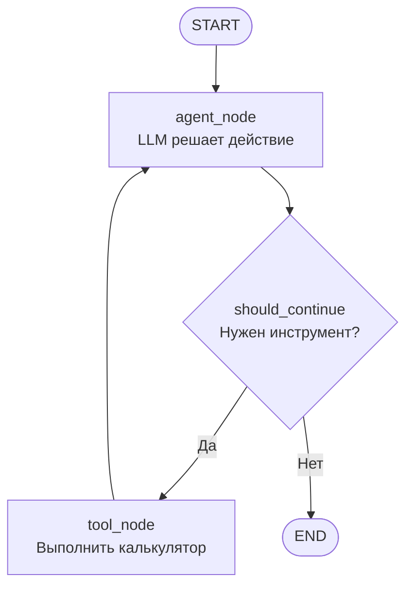

# План: Простой LangGraph агент с DeepSeek и инструментом

## Цель

Создать минималистичный реактивный агент на LangGraph, который:

- Использует DeepSeek в качестве LLM (ключ из переменной окружения `DEEPSEEK_API_KEY`)
- Имеет инструмент-калькулятор для математических операций
- Может самостоятельно решать, когда вызывать инструмент, а когда отвечать напрямую

## Структура файла `agent.py`

### 1. Импорты и зависимости

- `os` - для переменных окружения
- `langgraph.graph` - StateGraph, START, END для создания графа
- `langchain_core.messages` - HumanMessage, AIMessage, ToolMessage для работы с сообщениями
- `langchain_openai` - ChatOpenAI для DeepSeek (совместим с OpenAI API)
- `langchain_core.tools` - tool декоратор для создания инструментов
- `typing` - TypedDict для типизации состояния

### 2. Определение состояния агента

```python
class AgentState(TypedDict):
    messages: list  # История сообщений
```

### 3. Инструмент-калькулятор

- Функция с декоратором `@tool`
- Принимает математическое выражение
- Выполняет вычисление с помощью `eval()` (с базовой валидацией)
- Возвращает результат

### 4. Настройка LLM

- ChatOpenAI с параметрами:
  - `api_key=os.getenv("DEEPSEEK_API_KEY")`
  - `model="deepseek-chat"`
  - `base_url="https://api.deepseek.com"`
- Биндинг инструментов к LLM

### 5. Узлы графа

- **agent_node**: Вызывает LLM с историей сообщений и инструментами
- **tool_node**: Выполняет вызов инструмента и возвращает результат
- **should_continue**: Решает, нужно ли вызывать инструмент или завершить

### 6. Сборка графа

- Создание StateGraph
- Добавление узлов и рёбер
- Условное ветвление на основе решения агента
- Компиляция графа

### 7. Пример использования

- Функция `run_agent()` для интерактивного запуска
- Обработка ввода пользователя
- Вывод ответов агента

## Дополнительные файлы

### `requirements.txt`

Зависимости:

- `langgraph` - для создания графа агента
- `langchain-openai` - для работы с DeepSeek через OpenAI API
- `langchain-core` - базовые компоненты LangChain

### `.env.example` (опционально)

Пример файла с переменной окружения:

```
DEEPSEEK_API_KEY=your_api_key_here
```

## Архитектура агента



## Особенности реализации

- Реактивный агент: LLM сам решает, когда использовать инструмент
- Один файл: вся логика в `agent.py`
- Безопасность: базовая валидация входных данных для калькулятора
- Простота: минимальный код для демонстрации концепции