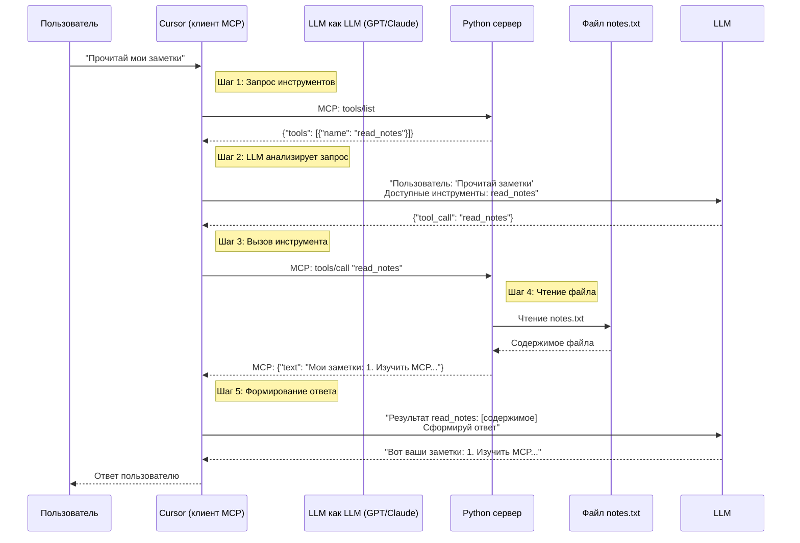

📄 Простейший MCP-сервер для чтения конкретного файла (Windows 11)
1. Файл сервера: simple_file_server.py
```python
# simple_file_server.py
import json
import sys

def main():
    """Простейший MCP сервер для чтения одного файла через stdio"""
    # Жестко заданный путь к файлу (измените на свой!)
    FILE_PATH = r"C:\Users\ваше_имя\Documents\notes.txt"
    
    while True:
        # Читаем ввод (JSON-RPC сообщение)
        line = sys.stdin.readline()
        if not line:
            break
            
        try:
            message = json.loads(line.strip())
            msg_id = message.get("id")
            method = message.get("method")
            
            # Ответ на инициализацию
            if method == "initialize":
                response = {
                    "jsonrpc": "2.0",
                    "id": msg_id,
                    "result": {
                        "protocolVersion": "2024-11-05",
                        "serverInfo": {"name": "simple-file-reader"},
                        "capabilities": {"tools": {}}
                    }
                }
            
            # Список инструментов
            elif method == "tools/list":
                response = {
                    "jsonrpc": "2.0",
                    "id": msg_id,
                    "result": {
                        "tools": [{
                            "name": "read_notes",
                            "description": "Прочитать файл notes.txt",
                            "inputSchema": {
                                "type": "object",
                                "properties": {},
                                "required": []
                            }
                        }]
                    }
                }
            
            # Вызов инструмента
            elif method == "tools/call":
                tool_name = message.get("params", {}).get("name", "")
                
                if tool_name == "read_notes":
                    try:
                        with open(FILE_PATH, 'r', encoding='utf-8') as f:
                            content = f.read()
                        text = f"Содержимое файла:\n\n{content}"
                    except FileNotFoundError:
                        text = f"Файл не найден: {FILE_PATH}"
                    except Exception as e:
                        text = f"Ошибка чтения: {str(e)}"
                    
                    response = {
                        "jsonrpc": "2.0",
                        "id": msg_id,
                        "result": {
                            "content": [{
                                "type": "text",
                                "text": text
                            }]
                        }
                    }
                else:
                    response = {
                        "jsonrpc": "2.0",
                        "id": msg_id,
                        "error": {"message": f"Неизвестный инструмент: {tool_name}"}
                    }
            
            else:
                response = {"jsonrpc": "2.0", "id": msg_id, "result": {}}
            
            # Отправляем ответ
            print(json.dumps(response, ensure_ascii=False), flush=True)
            
        except json.JSONDecodeError:
            continue

if __name__ == "__main__":
    main()
```
2. Быстрая настройка (3 шага)
Шаг 1: Установите Python
Скачайте Python с python.org

При установке галочка "Add Python to PATH"

Проверьте в PowerShell: python --version (должна быть версия 3.8+)

Шаг 2: Создайте и настройте файлы
1. Создайте папку для проекта:

```powershell
# В PowerShell или CMD
mkdir C:\mcp-server
cd C:\mcp-server
```
2. Сохраните код сервера в C:\mcp-server\simple_file_server.py
3. Измените путь к файлу в коде (строка 7):

```python
# Замените на ваш реальный путь
FILE_PATH = r"C:\Users\ваше_имя\Documents\notes.txt"
```
4. Создайте тестовый файл:

```powershell
# Создайте папку если нет
mkdir C:\Users\ваше_имя\Documents -Force

# Создайте файл с текстом
echo "Мои заметки:" > C:\Users\ваше_имя\Documents\notes.txt
echo "1. Изучить MCP" >> C:\Users\ваше_имя\Documents\notes.txt
echo "2. Подключить к Cursor" >> C:\Users\ваше_имя\Documents\notes.txt
```
Шаг 3: Подключение к Cursor IDE
Создайте конфиг файл Cursor:

Откройте Блокнот

Вставьте:

```json
{
  "mcpServers": {
    "my-file-reader": {
      "command": "python",
      "args": [
        "C:\\mcp-server\\simple_file_server.py"
      ]
    }
  }
}
```
Сохраните как:

```text
C:\Users\ваше_имя\.cursor\mcp.json
```
Важно: Создайте папку .cursor если её нет!

3. Запустите/Перезапустите Cursor

3. Тестирование в Cursor
1. Откройте Cursor
2. Нажмите Ctrl+K для вызова AI
3. Введите: "Прочитай мои заметки"
4. ИИ должен ответить содержимым файла

Визуализация работы:



4. Проверка вручную (без Cursor)
```powershell
# В одной консоли запустите сервер:
python C:\mcp-server\simple_file_server.py

# В другой консоли отправьте тестовые запросы:
# 1. Инициализация
echo '{"jsonrpc":"2.0","id":1,"method":"initialize","params":{}}' | python C:\mcp-server\simple_file_server.py

# 2. Запрос списка инструментов
echo '{"jsonrpc":"2.0","id":2,"method":"tools/list"}' | python C:\mcp-server\simple_file_server.py

# 3. Чтение файла
echo '{"jsonrpc":"2.0","id":3,"method":"tools/call","params":{"name":"read_notes","arguments":{}}}' | python C:\mcp-server\simple_file_server.py
```
🔧 Решение проблем
|Проблема	|Решение |
| -- | -- |
|"python не найдена"	|Переустановите Python с галочкой "Add to PATH"|
|Файл не найден	|Проверьте путь в FILE_PATH, используйте r"C:\полный\путь"|
|Cursor не видит сервер	|Убедитесь файл mcp.json в C:\Users\ваше_имя\.cursor\|
|Кодировка ошибка	|Добавьте encoding='utf-8' в open()|
Это минимальный рабочий вариант. Хотите добавить:

Чтение нескольких файлов?

Поиск по содержимому?

Автоматическое обновление при изменении файла?