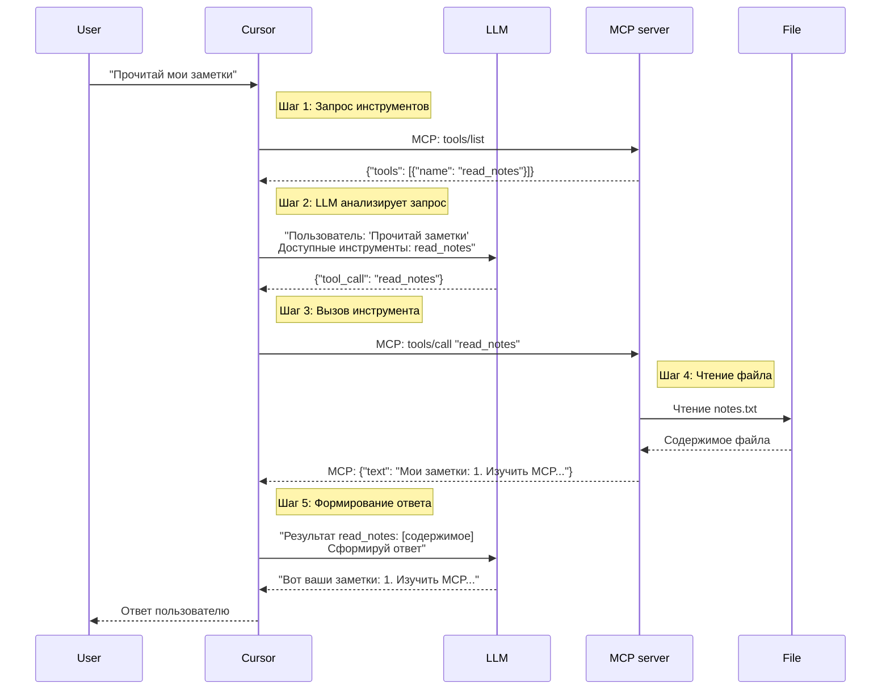

```mermaid
sequenceDiagram
    participant U as User
    participant C as Cursor
    participant LLM as LLM
    participant S as MCP server
    participant F as File

    U->>C: "Прочитай мои заметки"
    
    Note right of C: Шаг 1: Запрос инструментов
    C->>S: MCP: tools/list
    S-->>C: {"tools": [{"name": "read_notes"}]}
    
    Note right of C: Шаг 2: LLM анализирует запрос
    C->>LLM: "Пользователь: 'Прочитай заметки'<br/>Доступные инструменты: read_notes"
    LLM-->>C: {"tool_call": "read_notes"}
    
    Note right of C: Шаг 3: Вызов инструмента
    C->>S: MCP: tools/call "read_notes"
    
    Note right of S: Шаг 4: Чтение файла
    S->>F: Чтение notes.txt
    F-->>S: Содержимое файла
    
    S-->>C: MCP: {"text": "Мои заметки: 1. Изучить MCP..."}
    
    Note right of C: Шаг 5: Формирование ответа
    C->>LLM: "Результат read_notes: [содержимое]<br/>Сформируй ответ"
    LLM-->>C: "Вот ваши заметки: 1. Изучить MCP..."
    
    C-->>U: Ответ пользователю
```