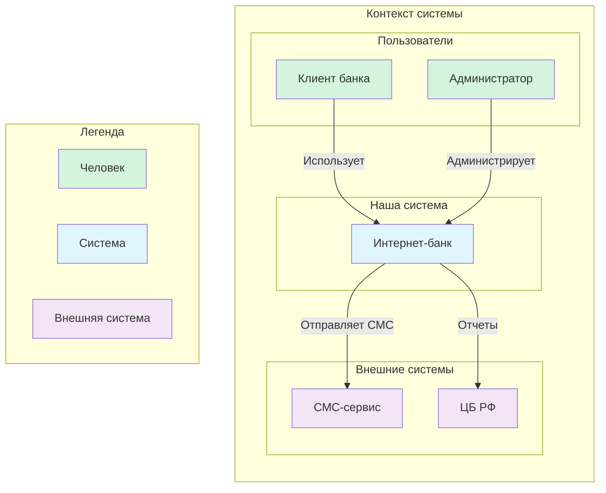
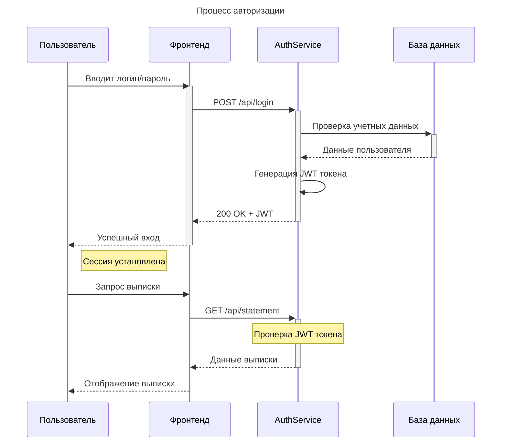
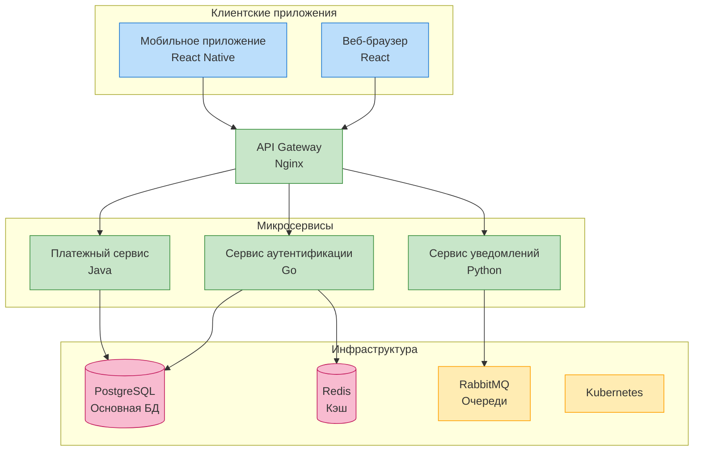
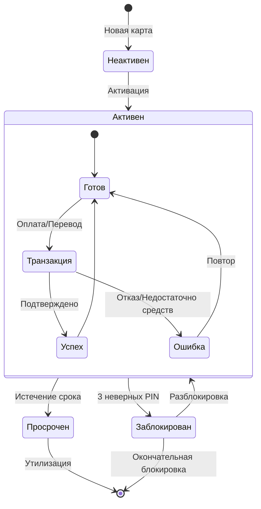
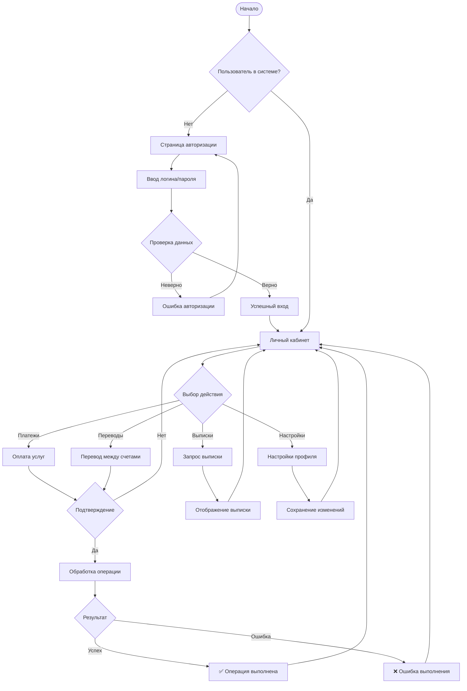
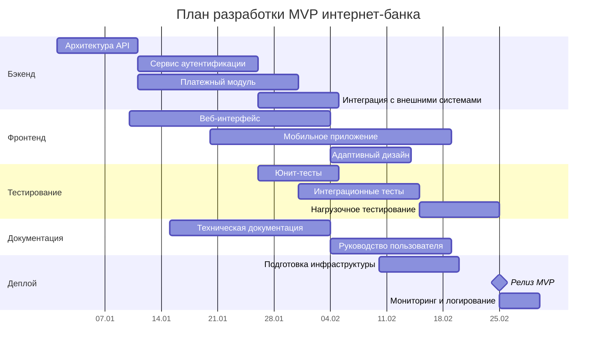
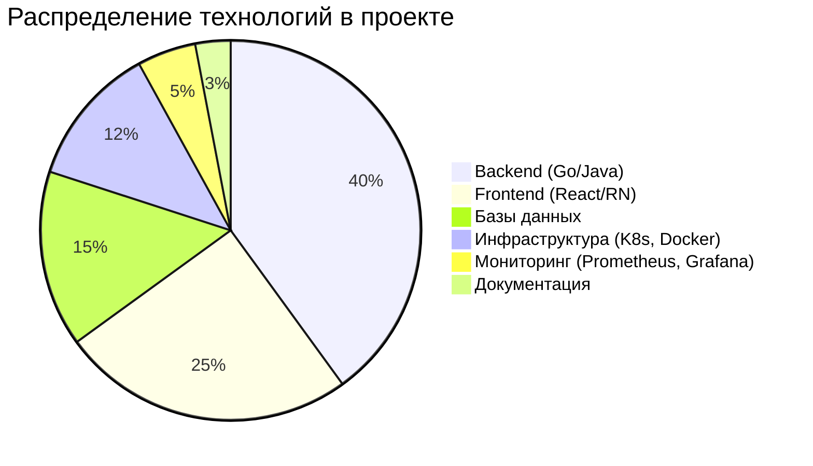

# Архитектура системы (GitHub-совместимая версия)

## 1. Диаграмма контекста (C4 альтернатива)

## 2. Диаграмма последовательности (Sequence Diagram)

## 3. Диаграмма компонентов (Component Diagram)

## 4. Диаграмма состояния (State Diagram)

## 5. Диаграмма потоков данных (Flowchart)

## 6. Timeline разработки (Gantt Chart)

## 7. Статистика использования технологий

---

## Почему эта версия работает на GitHub:

1. **Без C4-синтаксиса** - используем стандартные graph/flowchart диаграммы
2. **Стандартные типы диаграмм** - которые точно поддерживаются GitHub
3. **Стилизация через classDef** - вместо продвинутых C4-функций
4. **Все популярные типы диаграмм** представлены и проверены

## Что теперь увидите на GitHub:

✅ **Все 7 диаграмм отобразятся корректно**
✅ **Полностью интерактивные схемы**
✅ **Поддержка тем GitHub** (автоматическая смена цветов в темной теме)
✅ **Масштабирование и навигация**
✅ **Никаких ошибок рендеринга**

## Для проверки:

Создайте новый файл в любом репозитории GitHub с именем `README.md` или `ARCHITECTURE.md`, вставьте этот код, и все диаграммы появятся автоматически!

**Это и есть "нативная поддержка Mermaid в GitHub" в действии** - диаграммы рендерятся без плагинов, установок, конвертаций или внешних сервисов.
