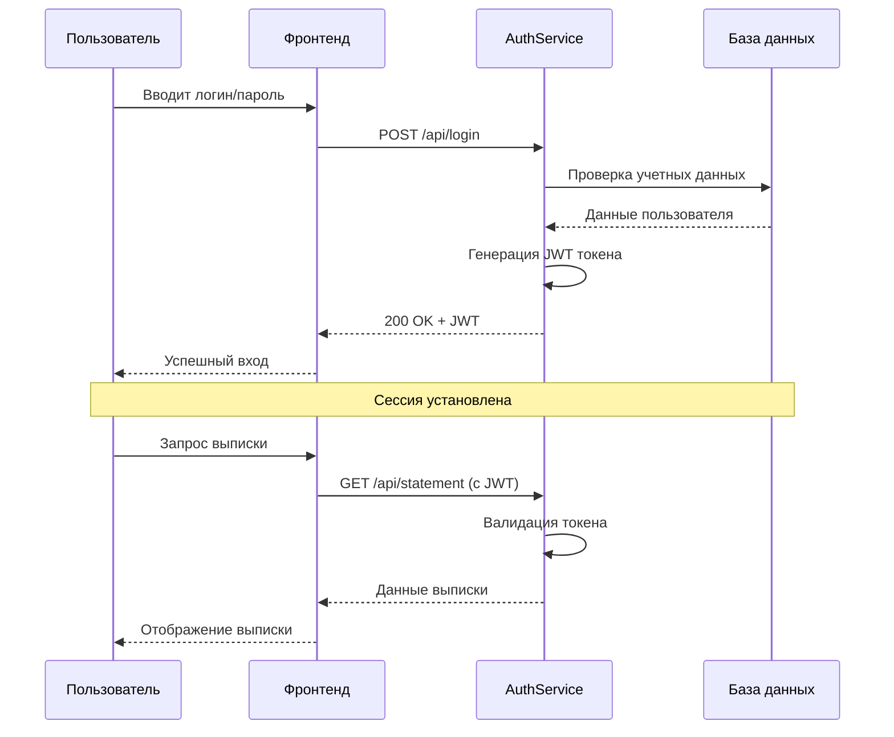
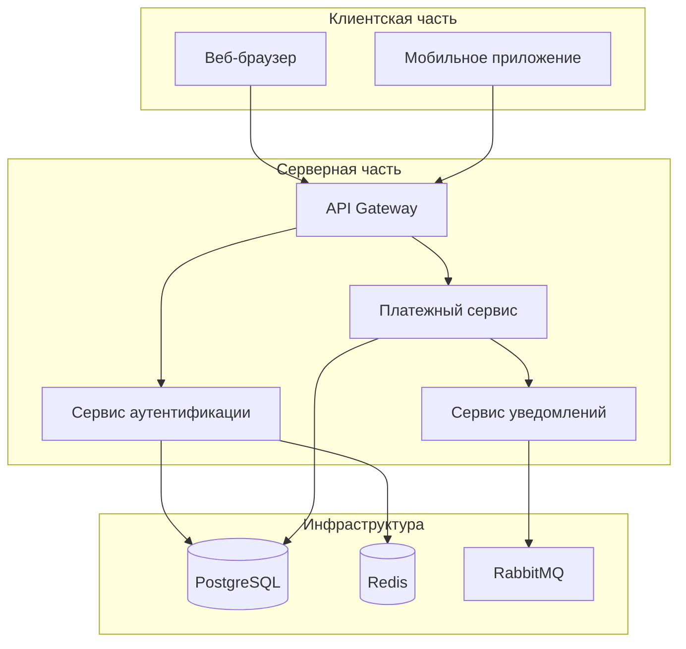
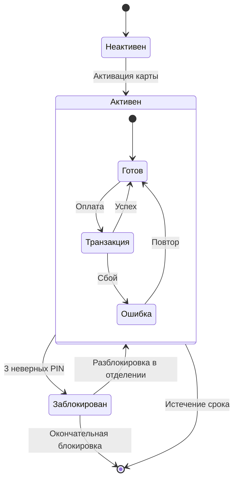
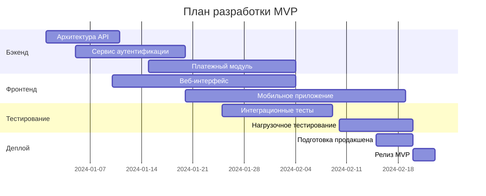
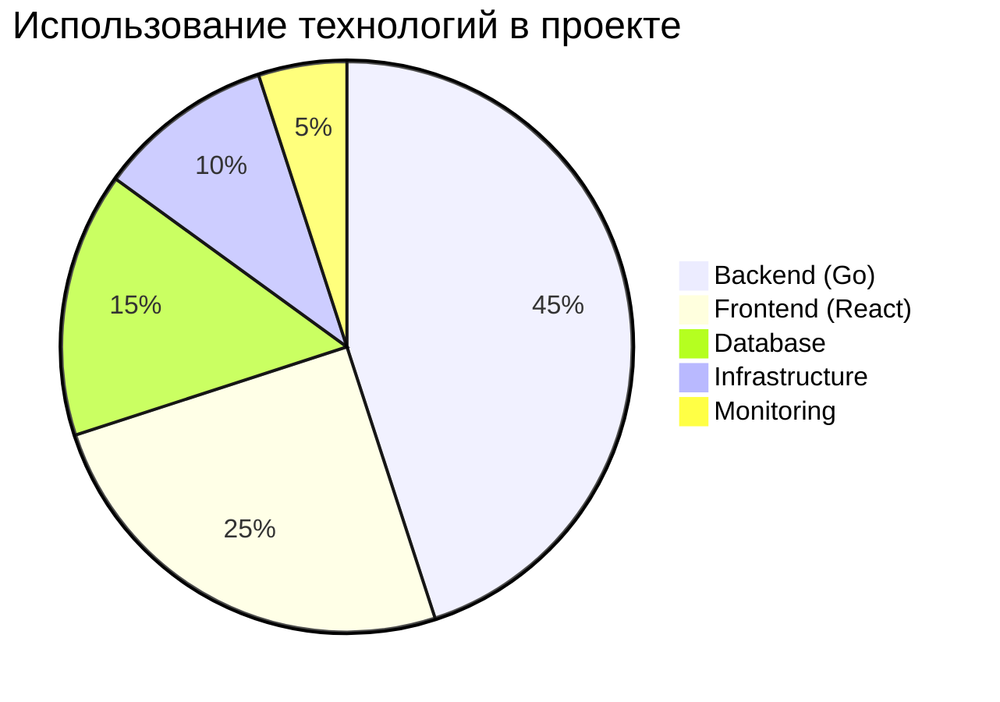

# Архитектура системы

## Диаграмма контекста C4

```mermaid
c4context
    title Системный контекст - Интернет-банк
    
    Person(customer, "Клиент", "Пользователь интернет-банка")
    Person(admin, "Администратор", "Сотрудник банка")
    
    System(banking_system, "Интернет-банк", "Обеспечивает управление счетами")
    
    System_Ext(sms_service, "СМС-сервис", "Отправка одноразовых паролей")
    System_Ext(cbr, "ЦБ РФ", "Внешняя система отчетности")
    
    Rel(customer, banking_system, "Использует для:", "Платежи\nПереводы\nВыписки")
    Rel(admin, banking_system, "Администрирует")
    Rel(banking_system, sms_service, "Отправляет СМС с OTP")
    Rel(banking_system, cbr, "Отправляет отчеты", "Ежедневно")
    
    UpdateLayoutConfig($c4ShapeInRow="3", $c4BoundaryInRow="1")
```

## Диаграмма последовательности



## Диаграмма компонентов



## Диаграмма состояния (State Diagram)



## Timeline разработки



## Статистика использования



---

## Как использовать:

1. **Сохраните этот текст** в файл с расширением `.mmd` или `.md`
2. **Загрузите в GitHub**:
   - Создайте новый репозиторий
   - Нажмите "Add file" → "Create new file"
   - Вставьте этот текст
   - Назовите файл `README.md` или `architecture.mmd`
   - Commit changes

3. **GitHub автоматически отрендерит все 6 диаграмм** прямо в интерфейсе!

## Что вы увидите на GitHub:

✅ **Все 6 диаграмм будут отображены как графики** без установки плагинов
✅ **Интерактивность** (в некоторых диаграммах)
✅ **Поддержка тем GitHub** (темная/светлая тема)
✅ **Масштабирование** под размер экрана

## Проверка перед загрузкой:

Вы можете проверить как это будет выглядеть на сайте Mermaid Live Editor:
https://mermaid.live/

Скопируйте любую секцию с ` ```mermaid ... ``` ` и вставьте в редактор.

---

**Ключевой момент:** После загрузки этого файла в GitHub, вам НЕ нужно:
- ❌ Устанавливать плагины
- ❌ Генерировать изображения
- ❌ Настраивать CI/CD для рендеринга
- ❌ Просить коллег установить что-либо

Диаграммы просто появятся для всех, кто имеет доступ к репозиторию. Это и есть **"нативная поддержка"**.