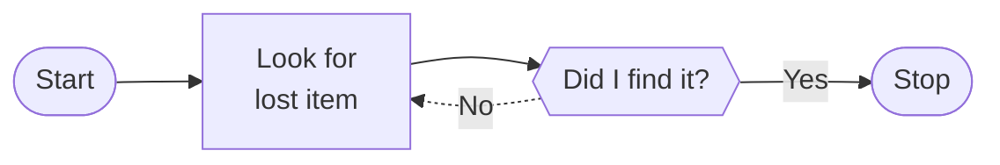
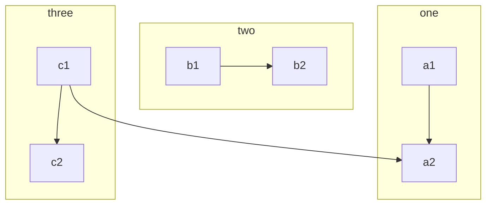
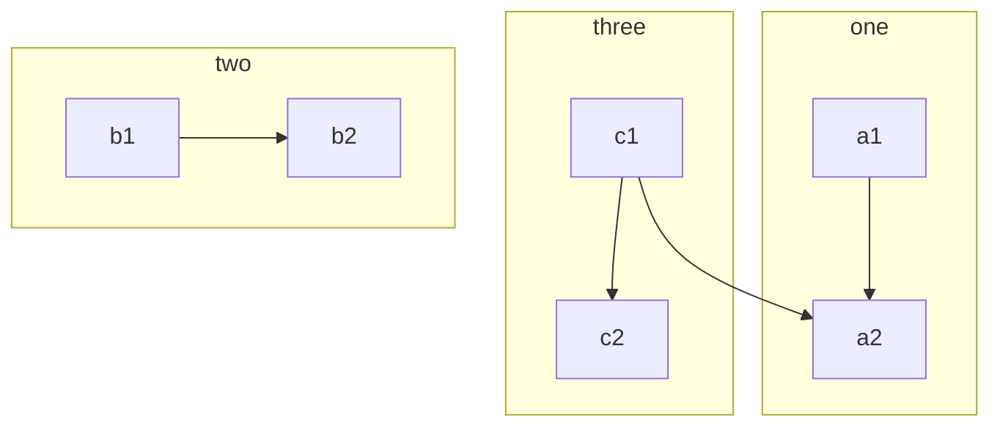
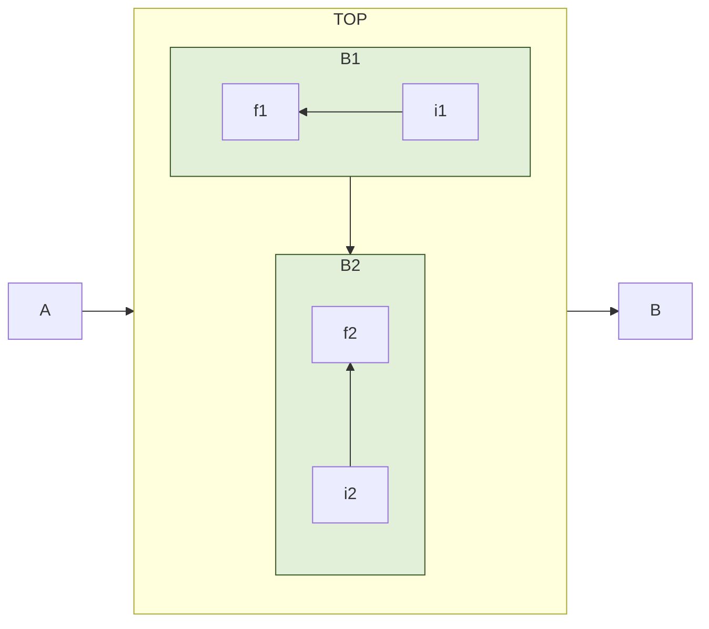
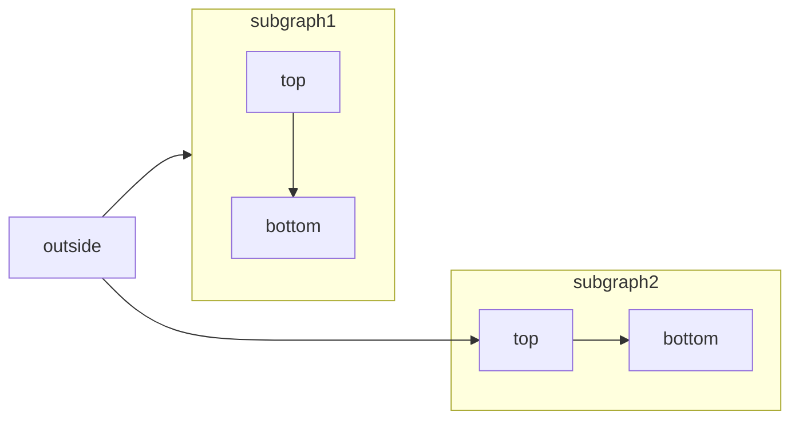
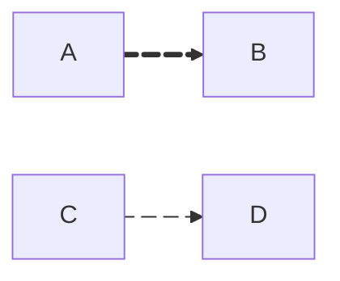

# Flochart diagram
* markdown работает

## Диаграмма 1. Simple Left-Right Graph
* ориентация рисунка слева направо (по умолчанию свержу вниз)
* формы (начертания контуров) элементов можно задать скобками
* типы стрелок
* метки стрелок
* комментарии

## Диаграмма 2. Subgraph (version 1)
Подграфы и связи между объектами из них
_Расположение элементов предсказать непросто_

## Диаграмма 2. Subgraph (version 2)
Поменяли местами подграфы two и three


## Диаграмма 2. Subgraph (version 3)
* Но лучше управлять расположением элементов, задавая направление стрелок
* Заодно переопредлили стиль подграфов B1, B2



## Диаграмма 2. Subgraph (version 4)
Направление (direction) для элементов за границами подграфов

## Диаграмма 3. Анимированные стрелки
Разной толщины и скорости анимации


## Node shapes
```mermaid
flowchart LR
    id1(This is the **text** in the box)
    id2([This is the *text* in the box])
    id3[[This is the text in the box]]
    id4[(Database)]
    id5((This is the text in the circle))
    id6>This is the text in the box]
    id7{This is the text in the box}
    id8{{This is the text in the box}}
    id9[/This is the text in the box/]
    id10[\This is the text in the box\]
    id11[/Christmas\]
    id12[\Go shopping/]
    id13(((This is the text in the circle)))
    id14@{ shape: manual-file, label: "File Handling"}
    id15@{ shape: manual-input, label: "User Input"}
    id16@{ shape: docs, label: "Multiple Documents"}
    id17@{ shape: procs, label: "Process Automation"}
    1d18@{ shape: paper-tape, label: "Paper Records"}
    id19@{ shape: notch-rect, label: "Card" }
    id20@{ img: "https://mermaid.js.org/favicon.svg", label: "My example image label", pos: "t", h: 60, constraint: "on" }
```