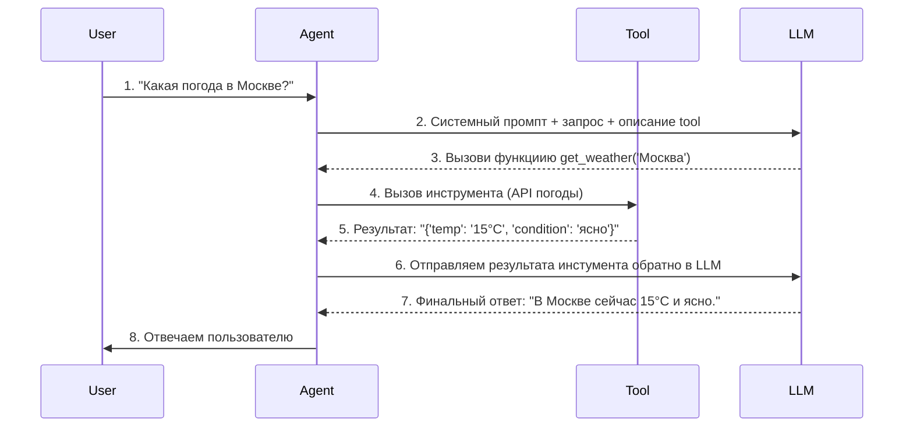

# Exercise 2: Проверяем возможности mermaid

Этот файл предназначен для выполняения упражнений с mermaid диаграммами в ходе учебного курса **"Проектируем ИТ-решения с использованием Cursor AI"**

## Диаграмма 1

