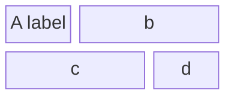
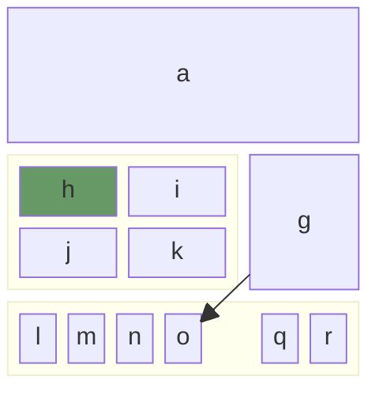
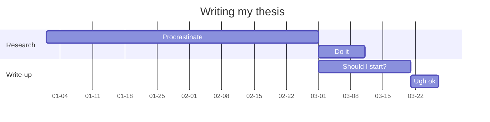
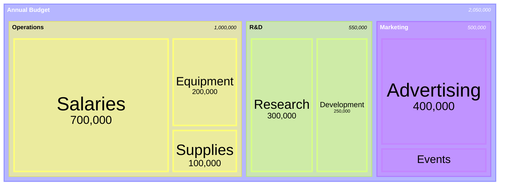
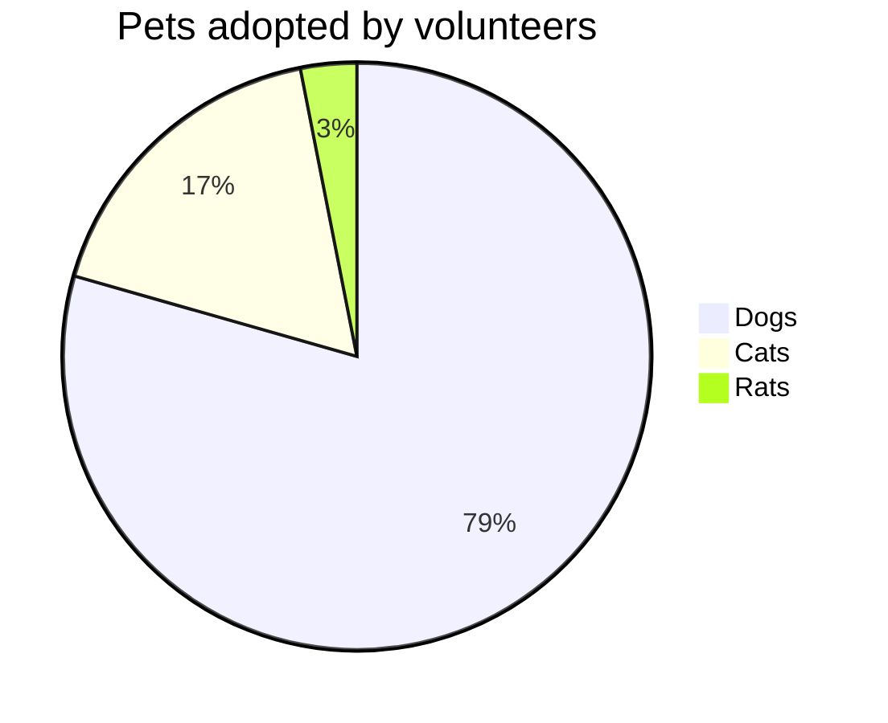
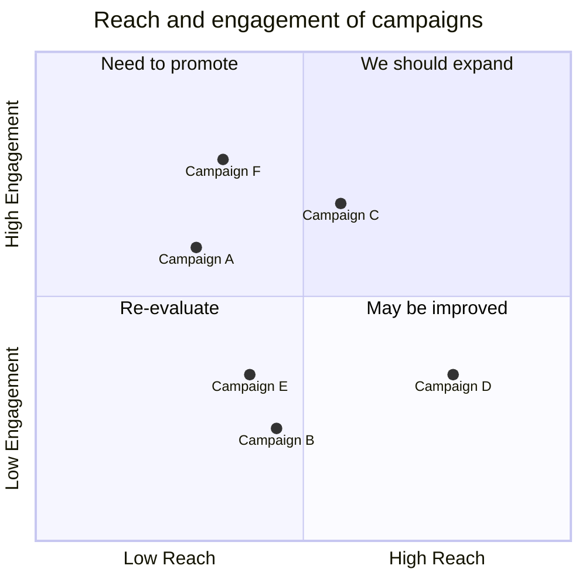

# Другие полезные Mermaid диаграммы

## Мой выбор: блочная диаграмма

## Диаграмма с вложенными блоками
* можно использовать стрелки (см. от **g** -> **o**)
* и раскрашивать блоки (см **h**)
* элемент **p** пропушен (space)

## Простая диаграмма Ганта

## Treemap (beta)
Подробнее посмотрите [Описание на сайте: mermaid.js.org](https://mermaid.js.org/syntax/treemap.html)

## Круговая диаграмма

## Матрица 2х2

