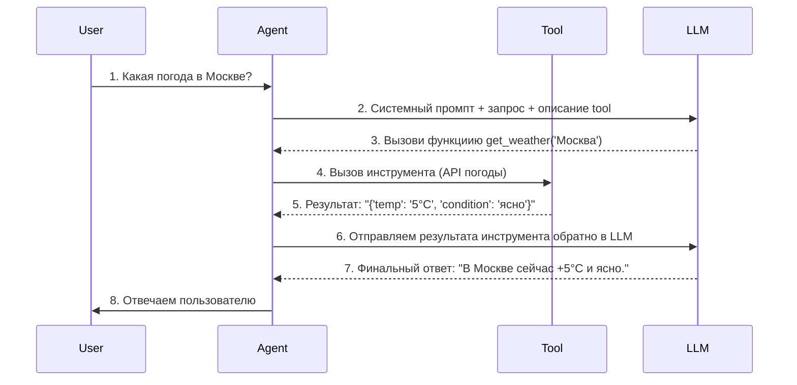
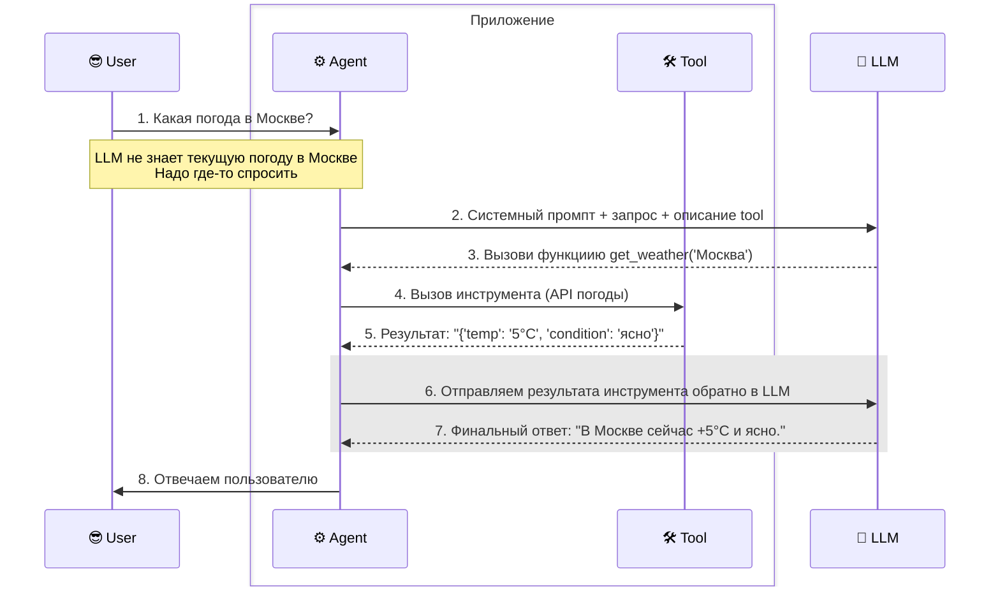
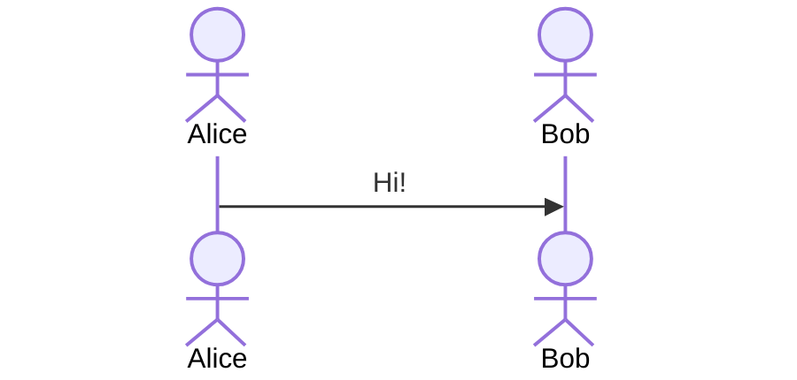
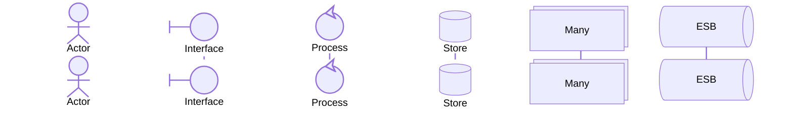
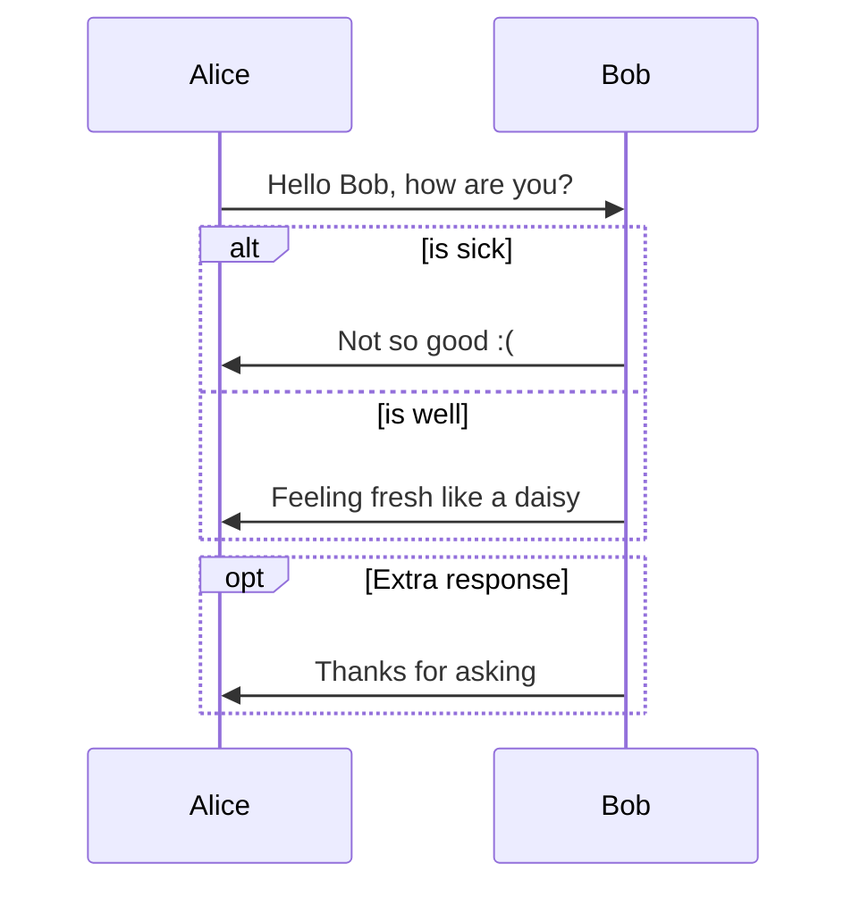

# Набор диаграмм последовательности (mermaid)

Несколько простых примеров mermaid диаграммами для учебного курса **"Проектируем ИТ-решения с использованием Cursor AI"**

## Предварительные замечания
* Markdown внутри Mermaid не поддерживаются. HTLML-вставки поддерживаются с оговорками

## Диаграмма 1 (версия 1)

## Диаграмма 1 (версия 2)
Делаем несколько улучшений:
* добавляем группировку: _Агент_ и _Инструмент_ реализованы в виде монолитного _Приложения_ 
* под первой стрелкой размещаем примечание (с переносом строк)
* осваиваем добавление комментариев
* подсвечиваем запрос-ответ прямоугольником

## Диаграмма 2
Стереотипы на диаграмме последовательности

## Диаграмма 2 (версия 2)
Стереотипы на диаграмме последовательности

## Диаграмма 3 Ветвления и циклы

