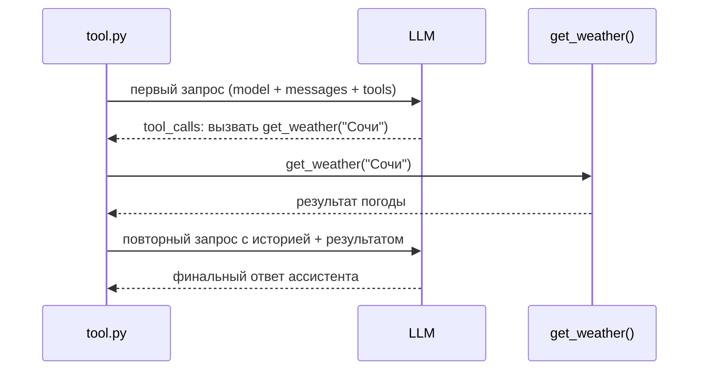

### Запрос к LLM + указание инструмента

```json
{
  "model": "gpt-4o",
  "messages": [
    {
      "role": "user",
      "content": "Какая погода в Сочи?"
    }
  ],
  "tools": [
    {
      "type": "function",
      "function": {
        "name": "get_weather",
        "parameters": {
          "type": "object",
          "properties": {
            "location": { "type": "string" }
          },
          "required": ["location"]
        }
      }
    }
  ]
}
```

### Ответ модели с параметром вызова инструмента

```json
{
  "choices": [
    {
      "message": {
        "role": "assistant",
        "tool_calls": [
          {
            "id": "call_123",
            "type": "function",
            "function": {
              "name": "get_weather",
              "arguments": "{\"location\": \"Сочи\"}"
            }
          }
        ]
      }
    }
  ]
}
```

### Финальный запрос к LLM с историей

```json
{
  "model": "gpt-4o",
  "messages": [
    { "role": "user", "content": "Какая погода в Сочи?" },
    {
      "role": "assistant",
      "tool_calls": [
        {
          "id": "call_123",
          "type": "function",
          "function": {
            "name": "get_weather",
            "arguments": "{\"location\": \"Сочи\"}"
          }
        }
      ]
    },
    {
      "role": "tool",
      "tool_call_id": "call_123",
      "content": "{\"location\": \"Сочи\", \"temperature\": \"22\", \"unit\": \"celsius\"}"
    }
  ]
}
```

###  Финальный ответ модели 

```json
{
  "choices": [
    {
      "message": {
        "role": "assistant",
        "content": "В Сочи сейчас около 22 °C."
      }
    }
  ]
}
```
