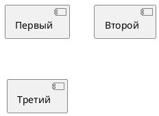
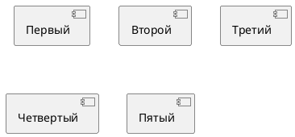
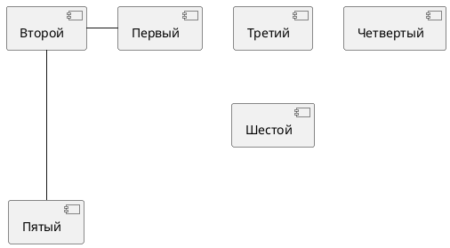
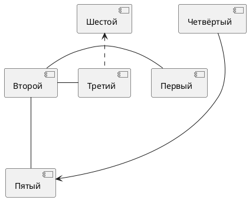

#  Расположение элементов в PlantUML

## Начинаем с трех


## Добавляем еще два



## Начинаем перставлять местами


## Продолжаем перестановки
* Поднимем шестой и свяжем его с третьим отношением зависимости
* Свяжем четвертый с пятым, но так, чтоб он к нему не примагнитился 

## Еще поиграем с ребками
Скроем вспомогтальное ребро и чуть поменяем остальные связи и элементы
```plantuml
@startuml
cloud Первый #lightgray
file Второй #text:blue
queue Третий
collections Четвёртый
folder Пятый #line:green 
database Шестой 
Первый -left[hidden]- Второй
Второй "+Владелец \t1" --down- "+Вещь \t*" Пятый : "Владеет >"
Второй "Конец1\n0..1" x-> "+Конец2\n2..*" Третий : "\t\t\t\t"
Третий .up.> Шестой
Четвёртый --[norank]> Пятый
@enduml
```
